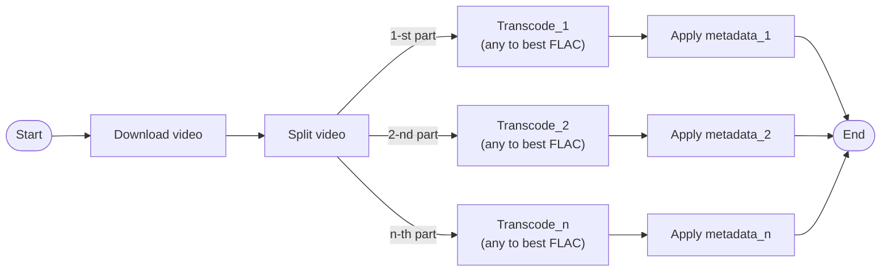
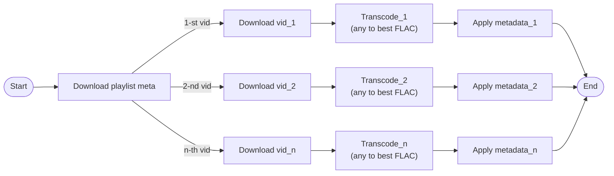

# Minjstroom project main spec

## Description

I want a self hosted music storage and streaming service. 
I want to be able to upload audio files as well as download them from YouTube 
using yt-dlp with rich features like splitting the file, trimming it, 
downloading whole playlists, retaining music metadata. 

Also for all files I want to support conversion to multiple formats
(best for streaming, best for old music players) and edit (including bulk edit) 
music metadata (including album covers). 

Also I want:
- to be able to create playlists there
- to be able to add lyrics to music (defer implementation of this for now)
- to be able to download music from there (choosing a format)

## Terms

Metadata -- collective naming for:

- track name
- album name
- artist name
- year
- genre
- album cover

Text metadata -- metadata w/o album cover

## Usecases

### Music upload

User uploads a file and then is prompted to fill in its metadata. Then
file is stored on the server and is added to the database.

### Youtube download

User either inputs a YT URL or search query. If query, app will
show the results for this query for the user to select something.
When user selects a video or a playlist or if URL was inputted, the
user is taken to the download screen.

If downloading video, app will again prompt for metadata defaulting for
video-based meta (thumbnail, channel name, date published, video name, etc). 
Then user should be able to cut the video in pieces if they'd like (or process as is). 
Each piece is a time range with their own metadata (except for the album cover — 
it's single for all of the pieces). Each piece could be toggled on or off — 
if user ever wants to save this piece. Then app proceeds to download the video. 
By default, pieces should be inferred from timecodes in the description 

If downloading playlist, then in the dialog there will be similar list as 
with single video pieces but this time each element being a separate video 
(each with their own editable meta) They cannot be cut there. Each video from 
playlist can be toggled or or off — download it or not.

For managing downloads there'll be download queue screen where we can see 
pending and in progress downloads. Pending downloads could be cancelled.

### Playlist management

Standard CRUD operations for managing playlists

### Delete track

Delete with file and delete it from all playlists it is part of

### Manage queue

YT downloads will be queued and we want to see what is in the queue: 
pending, currently downloading and failed. 
Pending downloads could be cancelled. 
For each failed download we must know the reason and be able to 
delete the failed download safely.

### See all songs

See all tracks with search option

## Implementation details

### Stack

I want a simple and very lightweight solution. Use python 3.13 with with UV. 
Use Litestar as a framework. Do not do API for now, we'll do SSR using Jinja.

Frontend-wise: please no design for now whatsoever. Plain html just to get it working.

### Auth

I want to be able to log in via instance password.

### Audio/video manipulation

Use ffmpeg and yt-dlp. Main format to use -- flac & aac (maybe configurable in config.yml. If
it will get too complex, ditch the configuration and make it fixed FLAC + AAC 192)

### Queue

All downloads will be queued. 
With some interval (to prevent spamblocking from youtube) we will get another element 
from queue and start downloading it. After file's been downloaded, 
it will apply selected changes through ffmpeg. 
After everything's ok it should use the queue to signal back to the 
main API that the file is ready. Then the API places a record down 
in the database and the file is successfully added. For queue, do 
not use separate queue services like kafka, rabbitmq or nats. 
Aim for small overall app footprint. 

I thought it would be great to use prefect for the pipelining. See more below.

### Deployment

Package everything into a configurable docker-compose.yml (already there)

### Pipelining

Roughly the pipelines we'll implement with Prefect:

`yt_video_flow.py`:

`yt_playlist_flow.py`:

